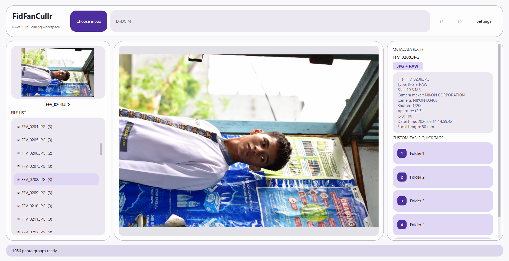
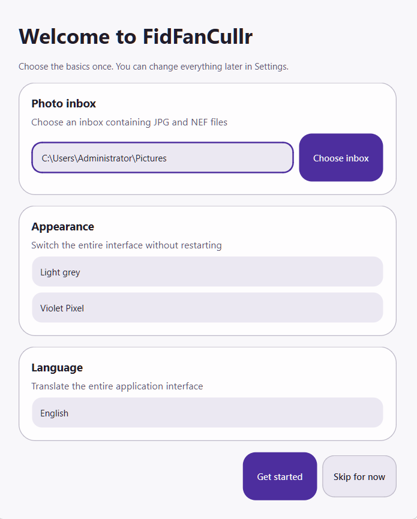
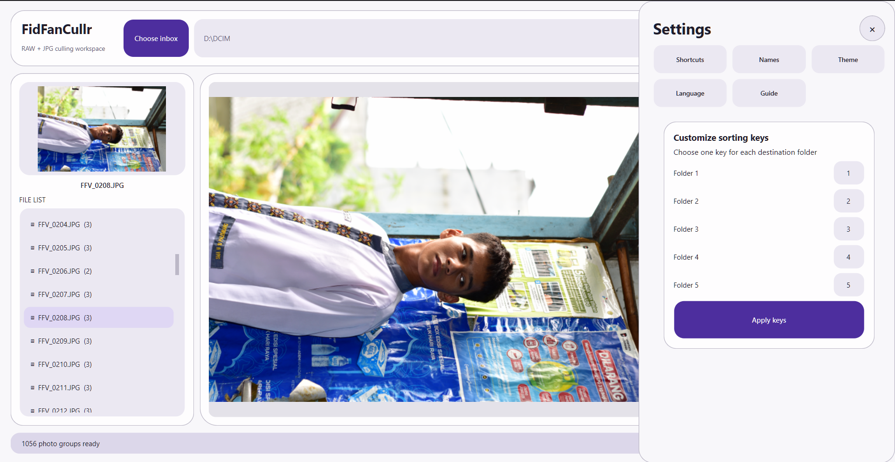
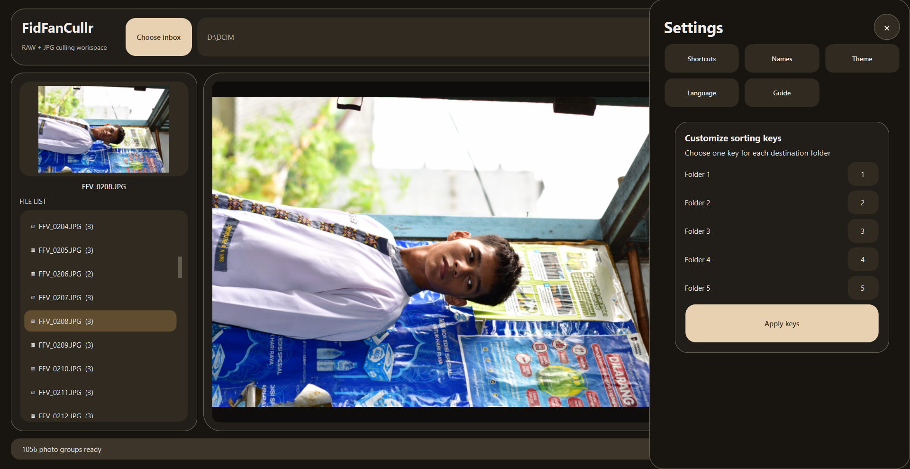

<div align="center">

# FidFanCullr

<p align="center">
  <strong>Fast. Focused. Made for Culling.</strong><br>
  A modern Windows photo culling application built for photographers.
</p>

<p align="center">
  
  
  
</p>

<p align="center">
  <i>Sort hundreds of photos without turning your workflow into a second job.</i>
</p>

</div>

---

## ✦ What is FidFanCullr?

FidFanCullr is a lightweight, portable Windows desktop application designed to make photo culling fast and simple.

Instead of opening a full photo editor just to decide which images survive, FidFanCullr focuses on one thing:

> **Review → Decide → Sort.**

It supports JPG, JPEG, and NEF photo groups, displays useful EXIF metadata, and lets you sort photos using customizable keyboard shortcuts.

No complicated catalog system.  
No cloud upload.  
No unnecessary editing tools.

Just your photos and the decisions that matter.

---

## ✦ Screenshots

### Main Workspace

<p align="center">
  
</p>

<p align="center">
  <sub>Review photos with a large preview, grouped files, EXIF metadata, and quick sorting controls.</sub>
</p>

### First Launch

<table>
<tr>
<td align="center">
  
</td>
</tr>
</table>

<p align="center">
  <sub>Choose your photo inbox, appearance, and language when starting FidFanCullr.</sub>
</p>

### Settings & Customization

<table>
<tr>
<td width="50%" align="center">
  
  <br><strong>Light Theme</strong>
</td>
<td width="50%" align="center">
  
  <br><strong>Dark Theme</strong>
</td>
</tr>
</table>

<p align="center">
  <sub>Customize sorting keys, interface appearance, language, names, and other workspace settings.</sub>
</p>

---

## ✦ Features

<table>
<tr>
<td width="50%">

### 📸 Fast Photo Culling

Review your photos quickly with a large preview designed for rapid selection.

- JPG / JPEG support
- NEF support
- Paired RAW + JPEG grouping
- Large image preview
- Zoom & pan
- One-click sorting

</td>
<td width="50%">

### 🗂 Smart Grouping

Photos with the same filename stem are automatically treated as a group.

For example:

```text
DSC_1042.JPG
DSC_1042.NEF
```

becomes one photo group.

Move the group once, and the associated files move together.

</td>
</tr>

<tr>
<td>

### 🧾 EXIF Metadata

Inspect important camera information while reviewing a photo.

Depending on the file, metadata can include:

- Camera
- Lens
- ISO
- Shutter speed
- Aperture
- Focal length
- Date & time
- Other available EXIF information

</td>
<td>

### ⌨️ Custom Sorting Keys

Build a workflow around your own keyboard shortcuts.

Assign sorting destinations to keys so you can cull without constantly reaching for the mouse.

```text
1 → KEEP
2 → SELECT
3 → REJECT
```

Your workflow, your keys.

</td>
</tr>

<tr>
<td>

### 🎨 Themes & Accent Colors

Customize the interface to match your setup.

Choose from built-in accent palettes:

- Violet Pixel
- Ocean Blue
- Mint Green
- Coral Peach

</td>
<td>

### 🌍 Multilingual

FidFanCullr supports multiple interface languages:

- 🇬🇧 English
- 🇮🇩 Indonesian
- 🇯🇵 Japanese
- 🇪🇸 Spanish
- 🇨🇳 Simplified Chinese

</td>
</tr>
</table>

---

## ✦ Material 3 Expressive

FidFanCullr uses a visual language inspired by Material 3 Expressive principles.

The interface focuses on:

- Strong visual hierarchy
- Expressive rounded shapes
- Tonal surfaces
- Dynamic accent colors
- Clear primary actions
- Consistent typography
- Purposeful motion
- Spacious layouts
- Distinct interactive states

The goal isn't to make Windows look like Android.

It's to bring a modern, expressive design system into a desktop photography workflow.

---

## ✦ The Workflow

```text
          ┌──────────────┐
          │  PHOTO INBOX │
          └──────┬───────┘
                 │
                 ▼
        ┌──────────────────┐
        │  GROUP BY NAME   │
        │     JPG + NEF    │
        └────────┬─────────┘
                 │
                 ▼
        ┌──────────────────┐
        │      REVIEW      │
        │   Preview + EXIF │
        └────────┬─────────┘
                 │
          ┌──────┴──────┐
          ▼             ▼
       KEEP /        REJECT /
       SELECT         OTHER
          │             │
          └──────┬──────┘
                 ▼
        ┌──────────────────┐
        │  SORTED FOLDERS  │
        └──────────────────┘
```

### 1. Choose an Inbox

Select the folder containing your photos.

### 2. Cull

Select a photo group and inspect the large preview.

### 3. Check Metadata

Use the EXIF panel to quickly inspect camera information.

### 4. Sort

Press your configured shortcut or click a destination.

### 5. Done

The complete JPG/NEF group is moved together.

---

## ✦ Designed for Keyboard-First Culling

Mouse users are welcome.

Keyboard users are understood.

| Control | Action |
|---|---|
| `Ctrl + Mouse Wheel` | Zoom preview |
| `Left Mouse Drag` | Pan preview |
| `R` | Reset zoom |
| Custom Keys | Sort current group |
| Settings | Customize workflow |

Sorting shortcuts can be completely customized.

---

## ✦ Customize Your Workspace

FidFanCullr keeps customization simple.

### Folder Names

Change the names displayed in the interface to match your workflow.

For example:

```text
KEEP
SELECT
REJECT
```

or:

```text
PORTFOLIO
EDIT
DELETE
```

The UI adapts to your workflow instead of forcing you to adapt to it.

### Theme

Switch between available interface themes.

### Accent

Choose your preferred accent palette.

### Language

Change the interface language from Settings.

### Shortcuts

Configure the keyboard keys used for sorting.

---

## ✦ Portable by Design

FidFanCullr can run as a standalone Windows executable.

Download:

```text
FidFanCullr.exe
```

No separate installation of:

- Python
- Qt
- Pillow
- rawpy
- EXIF libraries

is required when using the standalone build.

Settings are stored beside the application in:

```text
settings.json
```

---

## ✦ Getting Started

### Download

Download the latest `.exe` from the **Releases** page.

Run:

```text
FidFanCullr.exe
```

On first launch, configure:

- Photo inbox
- Theme
- Accent
- Language

Then start culling.

---

## ✦ Run From Source

For development:

```bash
python -m pip install PySide6 Pillow rawpy exifread numpy
python main.py
```

---

## ✦ Build

Install PyInstaller:

```bash
python -m pip install PyInstaller
```

Build the portable executable:

```bash
python -m PyInstaller --clean --noconfirm --onefile --noconsole --name FidFanCullr main.py
```

The resulting executable will be located at:

```text
dist/FidFanCullr.exe
```

---

## ✦ Tech Stack

```text
Python
   │
   ├── PySide6       → Desktop UI
   ├── Pillow        → Image processing
   ├── rawpy         → RAW / NEF decoding
   ├── ExifRead      → EXIF metadata
   └── NumPy         → Image processing support
```

---

## ✦ Philosophy

FidFanCullr is built around a simple idea:

> **Photo culling shouldn't feel like photo editing.**

Photographers often need to make hundreds of tiny decisions:

**Keep. Reject. Maybe. Next.**

FidFanCullr removes everything that gets between those decisions and the photographer.

Fast preview.  
Useful metadata.  
Keyboard shortcuts.  
Simple sorting.  
Nothing else getting in the way.

---

## ✦ Roadmap

Potential future improvements:

- [ ] More RAW formats
- [ ] More sorting workflows
- [ ] Advanced metadata filtering
- [ ] Additional themes
- [ ] More keyboard customization
- [ ] Improved preview performance
- [ ] Batch operations
- [ ] Additional export options

---

## ✦ License

FidFanStudios.

---

<p align="center">
  <strong>FidFanCullr</strong><br>
  <sub>Made for photographers who have better things to do than manually drag 800 files between folders.</sub>
</p>
